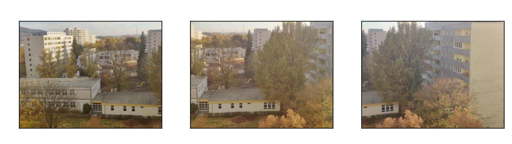
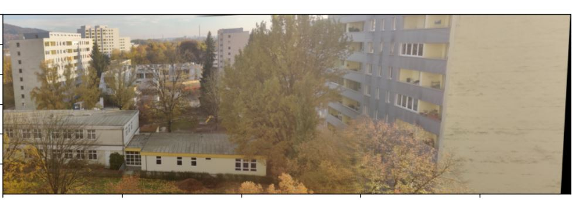

Simple python code on Jupyter notebook to stitch images and generate Panorama. Uses opencv,matplotlib and numpy in python. 

The project is to implement a featured based automatic image stitching algorithm. When we input two images with overlapped fields, we expect to obtain a wide seamless panorama.
We use scale invariant features transform(SIFT) to extract local features of the input images, K nearest neighbors algorithms to match these features and Random sample consensus(Ransac) to calculate the homograph matrix, which will be used for image warping. Finally we apply a smoothed weighted matrix as a mask for image blending.

More details on https://www.youtube.com/watch?v=J1DwQzab6Jg&t=2s

## Before Stitching

## After Stitching

